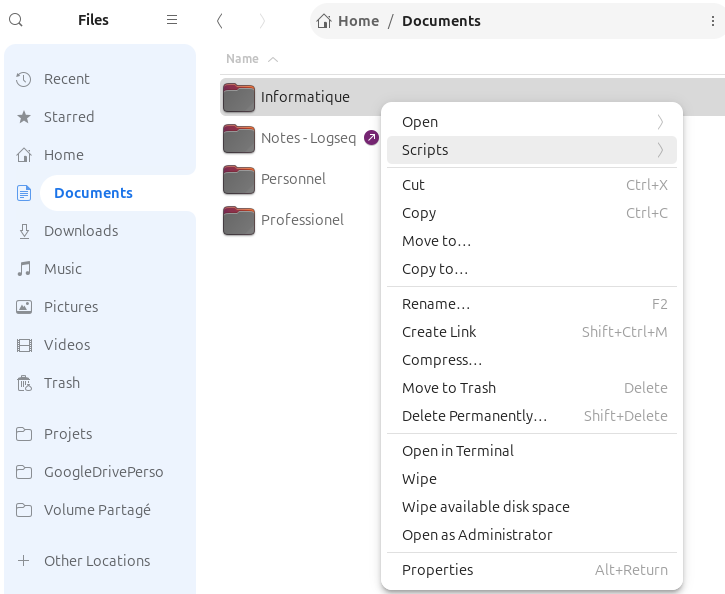

# 📌 Nautilus Scripts Automation

## 📖 Description

**Enhance your Nautilus !!**

This repository provides scripts for Nautilus, accessible via **right-click**. The `setup.sh` script automates their installation by creating **symbolic links** to Nautilus.

---

## 🛠 How It Works

Nautilus executes scripts via **Right-click > Scripts** and provides environment variables:

- `$NAUTILUS_SCRIPT_SELECTED_FILE_PATHS` → Selected files
- `$NAUTILUS_SCRIPT_CURRENT_URI` → Current folder




---

## 🔧 Installation

1️⃣ **Clone the repository**

```bash
git clone https://github.com/gwendalauphan/nautilus-scripts.git
cd nautilus-scripts
```

2️⃣ **Run the installation**

```bash
chmod +x setup.sh
./setup.sh
```

This script:
- Checks `scripts/`
- Creates `~/.local/share/nautilus/scripts` if necessary
- Adds symbolic links

3️⃣ **Usage**

- **Open Nautilus**
- **Right-click > Scripts > [Script Name]** 🚀

---

## 🗑 Uninstallation

```bash
find ~/.local/share/nautilus/scripts/ -type l -delete
```

---

## 📌 Update

Add new scripts to `scripts/` and rerun:

```bash
./setup.sh
```

🚀 **Enjoy your Nautilus scripts!**

# Repos source
Base: https://github.com/gwendalauphan/nautilus-scripts.git

